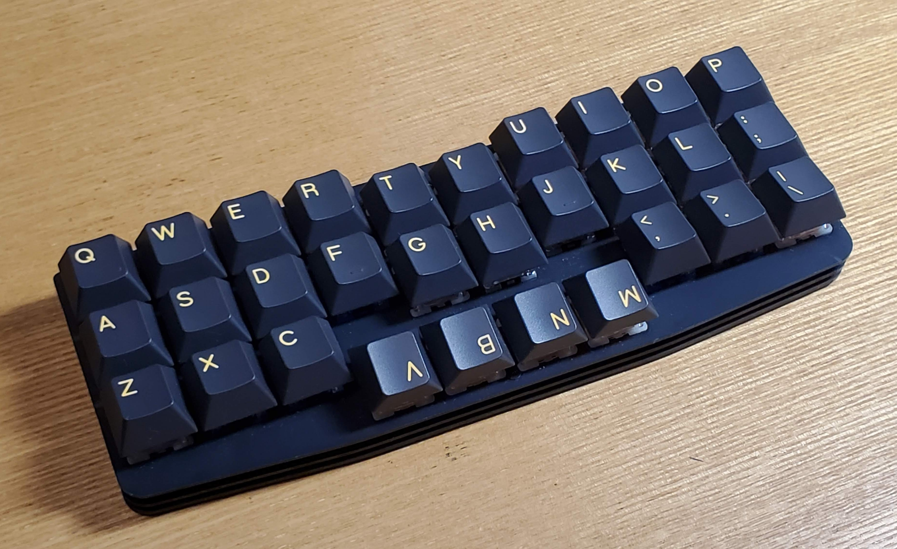

## 《3行×10列親指ずらし配列キーボード》「Dolphin30」ガイド

3行×10列の30キーのキーボードです。

### 特長
- 親指を存分に活用して入力できるように、3行目の中央4キーを0.5uだけ下にずらしてあります。
- 親指で4つのキーの文字入力およびレイヤーの切り替えをしながら、省スペースでスムーズな打鍵をすることができます。
- 4つのキーを下げて配置したことにより、一般的なオルソリニア配列と比べて、左右分離型キーボードのように両手をやや開いて楽な体勢で打鍵することができます。
- Vialに対応し、キーマップを自由に変更することが出来ます。
- 最小限のキー数で、複数レイヤーや、同時押しでの入力(VialのCombo機能)を活用し、通常のキーボードと遜色なく使用することが出来ます。
- マイコンとUSB端子を分離することで、極小の表面積(幅195mm×奥行70mm)と最小限の高さ(ゴム足からスイッチプレート上部まで13mm)を両立しています。

[このキーボードの配列について](layout.md)

このキーボードを設計した動機について。

### キーマップ・使い方

「...ここでの最重要ポイントは、親指で押すことになる「V B N M」のうち、1つにはスペースキーに場所を譲ってもらう、という点です...」

［next］(keymap.md)

[ビルドガイド](build.md)

このキーボードの作成手順です。

[ファームウェア](firmware/readme.md)

このキーボードのファームウェアが置いてあります。
